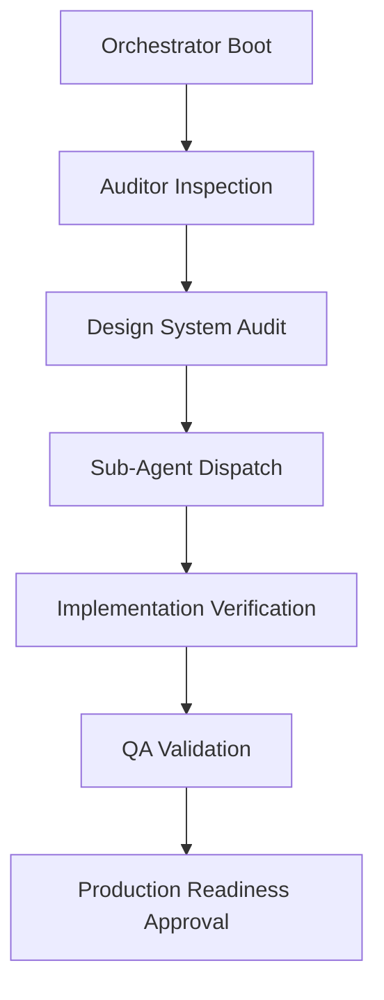

# GMA Agent Bootstrap Sequence (BOOTSTRAP)

This document outlines the execution and bootstrap sequence for the multi-agent system tasked with designing, auditing, implementing, and verifying the GMA Members Area Dashboard.

## 🔄 Execution Sequence

### 1. Alignment Phase
* **System Alignment**: Load all system rules and architectural constraints (no recursion, ledger updates, SQLite compatibility).
* **Workspace Setup**: Verify the repository structure, Prisma models, NextAuth session attributes, and existing routing pages.

### 2. Audit Phase (The Auditor)
* Inspect all existing routes in `src/app/user-dashboard`.
* Audit the API integrations in `src/app/api/user`.
* Generate the Dashboard Audit Report and the Component Inventory.

### 3. Delegation Phase (The Orchestrator)
* Spawn sub-agents using `invoke_subagent` following the profiles defined in `SUB_AGENTS.md`.
* Distribute tasks according to the component domains (Network, Member, KYC, Referral, Security, API, Admin Sync).
* Monitor background tasks and child agent transcripts using standard logs.

### 4. Compilation & Verification (QA & Production Readiness)
* Execute dynamic lint checks (`npm run lint`) and TypeScript checks (`npm run type-check`).
* Run the integration test suite (`scripts/test-mlm.ts`).
* Compile a final production build (`npm run build`) to ensure 100% zero-error static page optimization.
