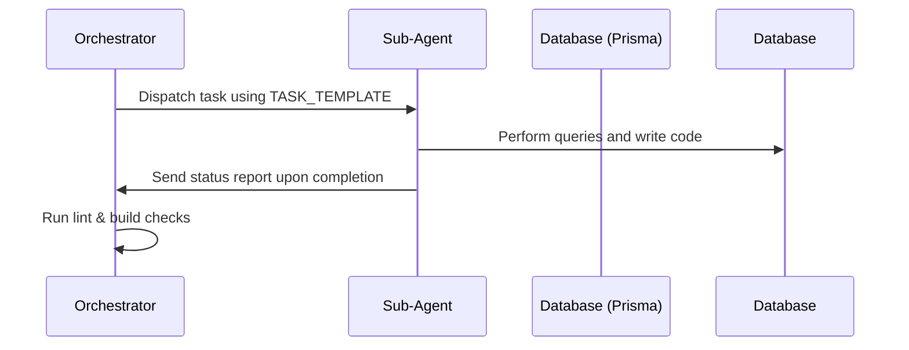

# GMA Orchestrator Specification (ORCHESTRATOR)

The Orchestrator acts as the central coordinator for the Members Area Dashboard design and implementation project.

## 📋 Responsibilities
1. **Initial Inspection**: Run Auditor tasks to evaluate the existing UI files and backend routes.
2. **Implementation Plan Compilation**: Draft the implementation plan detailing open items and proposed improvements.
3. **Sub-Agent Allocation**: Instantiate specialized sub-agents via `invoke_subagent` using standard system definitions from `SUB_AGENTS.md`.
4. **Code Merging & Verification**: Review the output of all sub-agents, clean up redundant imports or styling overrides, and execute verification scripts.
5. **Final QA Check**: Ensure compilation check passes (`tsc --noEmit`), linter runs cleanly (`npm run lint`), and production build compiles (`npm run build`).

## 🔄 Synchronization Flow

